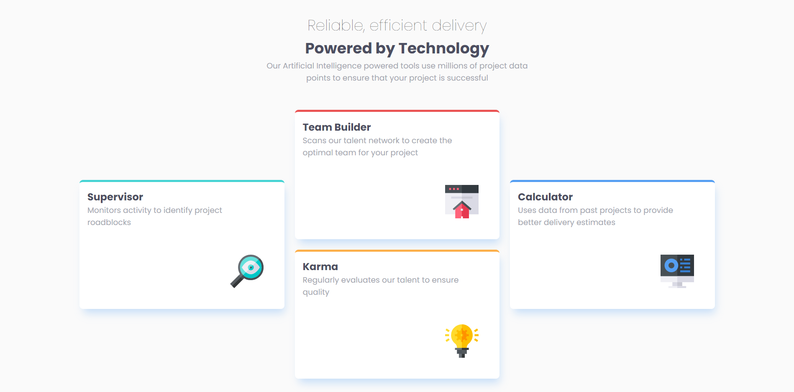

# Frontend Mentor - Four card feature section solution

This is a solution to the
[Four card feature section challenge on Frontend Mentor](https://www.frontendmentor.io/challenges/four-card-feature-section-weK1eFYK).
Frontend Mentor challenges help you improve your coding skills by building
realistic projects.

## Table of contents

- [Overview](#overview)
  - [The challenge](#the-challenge)
  - [Screenshot](#screenshot)
  - [Links](#links)
- [My process](#my-process)
  - [Built with](#built-with)
  - [What I learned](#what-i-learned)
  - [Useful resources](#useful-resources)
- [Author](#author)
- [Acknowledgments](#acknowledgments)


## Overview

### The challenge

Users should be able to:

- View the optimal layout for the site depending on their device's screen size

### Screenshot



### Links

- Solution URL: [Add solution URL here](https://your-solution-url.com)
- Live Site URL: [Add live site URL here](https://your-live-site-url.com)

## My process

### Built with

- Semantic HTML5 markup
- CSS custom properties
- CSS Grid
- Mobile-first workflow

### What I learned

I practiced the use of CSS grid template areas.

To see how you can add code snippets, see below:

```css
.proud-of-this-css {
	color: papayawhip;
	grid-template-column: repeaat(3, 1fr);
	grid-template-area:
		". team ."
		"supervisor team calculator"
		"supervisor karma calculator"
		". karma .";
	/* use dot to add empty space */
	/* there are three columns hence three items on each line */
}
```

### Useful resources

- [Net Naija's video on grid areas](https://www.youtube.com/watch?v=tPosqmwIx0w) -
  This helped me for understand and implement the grid areas.

## Author

- Frontend Mentor - [@favvie](https://www.frontendmentor.io/profile/favvie)
- Twitter - [@\__kenpachi_](https://www.twitter.com/__kenpachi_)

## Acknowledgments

I am shouting out to @GenesisGran. His solution provided some insight.
